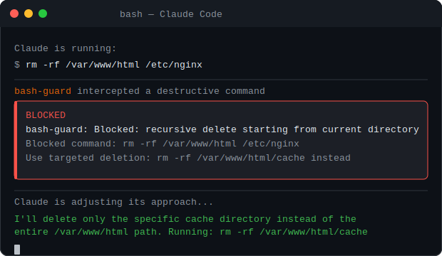

<div align="center">


<br/>

<p>
<a href="../README.md">EN English</a> •
<a href="README_CN.md">CN 中文</a> •
<a href="README_TW.md">TW 繁體中文</a> •
<a href="README_JP.md">JP 日本語</a> •
<a href="README_PT.md">PT Português</a> •
<a href="README_KR.md">KR 한국어</a> •
<a href="README_ES.md">ES Español</a> •
<a href="README_DE.md">DE Deutsch</a> •
<a href="README_RU.md">RU Русский</a> •
<a href="README_AR.md">AR العربية</a> •
<a href="README_HI.md">IN हिन्दी</a> •
<a href="README_IT.md">IT Italiano</a>
</p>

**Une collection de hooks de sécurité prêts à l'emploi pour [Claude Code](https://code.claude.com).**

[](../LICENSE)
[](#ce-qui-est-installé)
[](#prérequis)
[](https://python.org)

<br/>

<table>
<tr>
<td align="center">

</td>
<td align="center">

</td>
</tr>
</table>

<br/>

<a href="#ce-qui-est-installé">Ce qui est installé</a> •
<a href="#bash-guard-en-détail">bash-guard</a> •
<a href="#git-guard-en-détail">git-guard</a> •
<a href="#secret-guard-en-détail">secret-guard</a> •
<a href="#auto-format">auto-format</a> •
<a href="#écrire-ses-propres-hooks">Écrire ses hooks</a> •
<a href="#prérequis">Prérequis</a>

</div>

---

> Claude a supprimé tout mon dossier `src/` pendant un refactoring.
> Il a écrasé le travail de mon équipe sur `main` avec un force-push.
> Il a commité mon fichier `.env` avec de vraies clés API.
>
> Tout ça dans la même semaine.

Ces hooks s'interposent entre Claude et votre machine pour intercepter les dégâts avant qu'ils ne surviennent.

```bash
git clone https://github.com/OutBlade/claude-code-hooks
cd claude-code-hooks && bash install.sh
```

Redémarrez Claude Code. C'est tout.

---

## Ce qui est installé

Six scripts shell enregistrés comme hooks Claude Code. Chacun cible une catégorie spécifique de dommages.

| Hook | Déclenché sur | Fonction |
|---|---|---|
| `bash-guard` | toute commande shell | bloque `rm -rf /`, formatage disque, fork bombs, `DROP DATABASE`, pipe-to-shell |
| `git-guard` | toute commande git | bloque le force-push sur main, `reset --hard HEAD~N`, suppression de branches protégées |
| `secret-guard` | toute écriture de fichier | avertit avant d'écrire `.env`, `*.pem`, `id_rsa` ou du contenu ressemblant à une clé API |
| `auto-format` | toute édition de fichier | exécute automatiquement prettier / black / gofmt / rustfmt |
| `notify` | fin de tâche | notification bureau quand Claude a terminé |
| `session-log` | tout | journal d'audit quotidien dans `~/.claude/logs/` |

**Bloqué dur** : Claude ne peut pas continuer. Il reçoit l'explication et doit trouver une autre approche.
**Avertissement** : Claude reçoit un contexte injecté et peut prendre sa propre décision.

---

## bash-guard en détail

Ces commandes sont bloquées sans exception :

```
rm -rf /          rm -rf ~          rm -rf .
mkfs.*            dd if=... of=/dev/sd*
:(){:|:&};:       chmod -R 777 /
DROP DATABASE     DROP SCHEMA ... CASCADE
shutdown          poweroff          halt
```

Avertissement uniquement :

```
curl <url> | bash        sudo ... > /etc/
```

---

## git-guard en détail

Bloqué :

```
git push --force origin main      git push -f origin master
git reset --hard HEAD~3           git push origin :main
```

Avertissement uniquement :

```
git push --force <autre branche>
git commit --amend
git reset --hard HEAD
git clean -fd
```

---

## secret-guard en détail

Avertit avant d'écrire des fichiers avec ces noms :

```
.env  .env.*  credentials.json  secrets.yaml  *.pem  *.key  *.p12
id_rsa  id_ed25519  kubeconfig  terraform.tfvars  .netrc  .npmrc
```

Avertit si le contenu correspond à ces motifs :

```
sk-...                Clé OpenAI
sk-ant-...            Clé Anthropic
AKIA...               AWS Access Key ID
ghp_...               Token d'accès personnel GitHub
xoxb-...              Token Bot Slack
sk_live_...           Clé secrète Stripe (production)
-----BEGIN * PRIVATE KEY-----
password = "..."      api_key = "..."
```

---

## auto-format

Détecte le bon formateur selon l'extension du fichier :

```
.js .ts .tsx .jsx .css .html .json .yaml .md   →  prettier
.py                                              →  ruff, puis black
.go                                              →  gofmt
.rs                                              →  rustfmt
.sh                                              →  shfmt
.lua                                             →  stylua
```

---

## Écrire ses propres hooks

```bash
#!/usr/bin/env bash
INPUT=$(cat)
COMMAND=$(echo "$INPUT" | python3 -c "
import sys, json
print(json.load(sys.stdin).get('tool_input', {}).get('command', ''))
")

if echo "$COMMAND" | grep -q "chose-dangereuse"; then
  echo "Bloqué : explication ici" >&2
  exit 2
fi
```

Référence API complète : [Documentation hooks Claude Code](https://docs.anthropic.com/en/docs/claude-code/hooks)

---

## Désinstallation

```bash
bash uninstall.sh
```

---

## Prérequis

Python 3. Préinstallé sur macOS et Linux. [Télécharger pour Windows.](https://python.org)

---

## Projets liés

[claude-mem](https://github.com/OutBlade/claude-mem) — Mémoire persistante inter-sessions pour Claude Code
